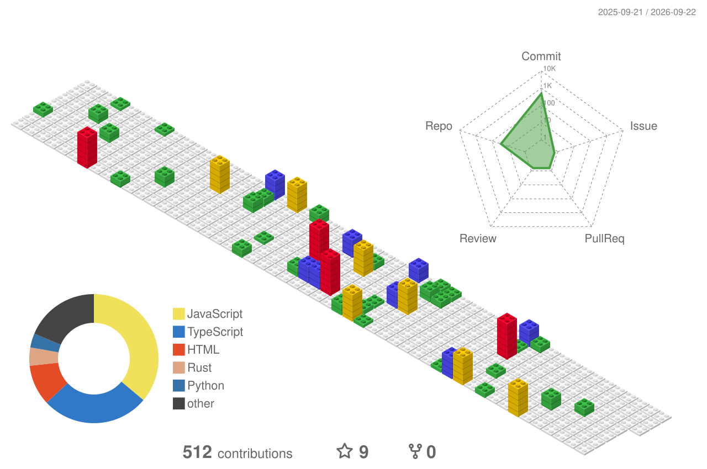

<h1 align="center">
    
</h1>

  

# 💫 About Me:

🔭 I’m currently studying B.Tech in C.S.E. 📌I'm a driven individual focused on building AI-powered products and turning ideas into reality. 🖊️Also I am Interested in Web3 and Blockchain . 🖥️And I am into robotics and a lots of techs. 🕹️Also curious about design and constantly exploring ways to create better user experiences. 😃Always learning, building, and moving forward. 

 
## 🌐 Socials:
    

# 💻 Tech Stack:
                                                                  
# 📊 GitHub Stats:
 
 

## 🏆 GitHub Trophies

  

<em>*The language charts are based on recent commits.</em>

  

<!-- Snake Game Repo View -->

  

### ✍️ Random Dev Quote

### 🔝 Top Contributed Repo

---

<!-- Proudly created with GPRM ( https://gprm.itsvg.in ) -->
